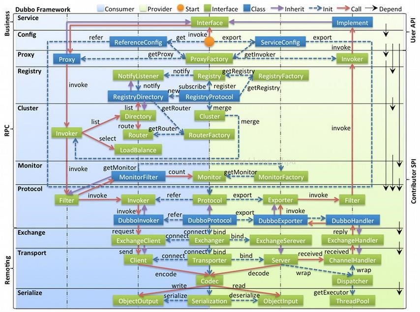

#深入理解Dubbo
## Dubbo组件
- 组件
  - Provider 提供者
    - 一个集群中的服务提供者
    - 会将自己的服务注册到注册中心 方便消费者找到
  - Consumer 消费者
    - 服务的调用者
    - 通过注册中心得到提供者的信息
    - 通过RPC远程调用服务
  - Registry 注册中心
    - 服务的注册与发现
  - Monitor  监控中心
    - 统计服务的效用次数和调用时间
- 调用关系
  - 提供者在启动时将自己的信息注册到注册中心
  - 消费者在启动时从注册中心订阅自己需要的服务的地址 注册中心异步的将数据返回给消费者 消费者通过预设的平衡算法选择提供者调用
  - 监控中心统计服务的调用次数和调用时间 并每分钟固定一次的将数据发送给注册中心
## Dubbo项目结构
- SDK模块（也有些叫做API）
  - 提供服务的接口
  - 提供服务中的实体类
- Provider模块
  - 需要实现SDK中的接口并暴露
- Comsumer模块
  - 通过远程调用Provider中的实现来实现一些别的功能
## 如何确定一个Dubbo接口
- 服务接口
- 服务分组
- 服务版本
## Dubbo的结构
在Dubbo中 也有类似于互联网的分层结构 每一层依赖于其下一层的实现来完成自己的功能 并为上一层提供服务 每一层都可以使用别的实现 更换实现也不会影响到别的层的功能

用户可以通过自己实现Dubbo提供的接口来替换原有的实现（书本中只有通过Spring实现的方式 以我的经验 在Springboot中估计是通过添加Bean和在配置文件中加入来实现的）

- 分层实现
  - Service和Config层
    - 是Dubbo的API层
    - Provider通过ServiceConfig
    - Consumer通过ReferenceConfig
  - 其他均为SPI（Service Provider Interface）层
    - 下面个层都是组件化的 可以被替换
- 具体各层
  - Service
    - SDK的接口
    - Provider的实现类
  - Config
    - 服务的Start
    - Provider的ServiceConfig
    - Comsumer的ReferenceConfig
  - Proxy
    - 把本地调用透明的转换为远程调用
    - 对服务提供方的服务实现类转换为Wrapper类 减少反射次数
    - SPI接口为ProxyFactory
      - JavassistProxyFactory 默认
      - JdkProxyFactory
    - Provider是Invoker
    - Consumer是Proxy
  - Registry
    - 注册中心
    - SPI为RegistryFactory
    - 主要是通过Registry接口的扩展类
    - 主要的实现 对应实现了Redistry和RegistryFactory
      - Zookeeper
      - Redis
      - Muliticast
      - Dubbo
  - Cluster
    - 路由层
    - 在多个Provider的时候可以通过不同的路由方式选择调用哪一个Provider
    - 提供
      - 路由规则
      - 负载均衡
        - LoadBalance
          - 随机
          - 轮询
          - 最小活跃数
          - 一致性哈希
      - 集群容错
        - Cluster接口
          - 失败重试
          - 失败自动恢复
          - 快速失败
          - 失败安全
          - 并行调用
  - Monitor
    - 监控
    - MonitorFactory
      - DubboMonitorFactory
  - Protocol
    - 远程调用层
    - 远程调用逻辑
    - Protocol
      - Registry
      - Dubbo
      - Injvm
  - Exchange
    - 信息交换层
    - 封装请求响应的模式
    - Exchange
      - HeaderExchange
  - Transport
    - 网络传输层
    - 将Mina和Netty封装成统一的接口
    - Channel
      - Netty
      - Mina
    - Transport
      - Netty
      - Grizzly
      - Mina
  - Serialize
    - 序列化层
    - Serialize